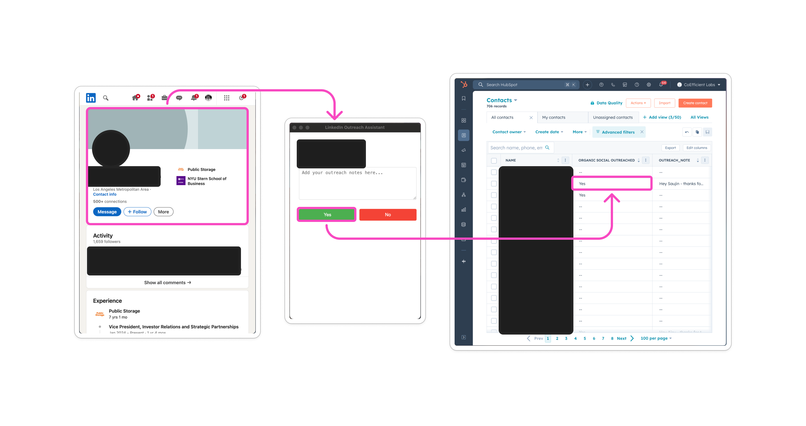

# LinkedIn Outreach Assistant

A Chrome extension that streamlines the LinkedIn outreach process by integrating with HubSpot. This tool helps manage and track outreach efforts efficiently by allowing users to view LinkedIn profiles and update contact statuses directly from the browser.



## Features

- �� Secure authentication system for organizational access
- �� Seamless integration between LinkedIn and HubSpot
- �� Add outreach notes directly from LinkedIn
- ✅ Quick Yes/No status updates
- �� Automatic contact status synchronization with HubSpot
- �� Support for both local development and production environments

## Project Structure

## Project Structure

```plaintext
stage_updater_org/
├── backend/
│   ├── lambda_functions/
│   │   ├── auth/
│   │   │   └── lambda_function.py
│   │   ├── get-contact/
│   │   │   └── lambda_function.py
│   │   ├── update-contact/
│   │   │   └── lambda_function.py
│   │   └── test_lambda.py
│   ├── requirements.txt
│   └── .env
├── chrome-extension/
│   ├── icons/
│   │   ├── icon16.png
│   │   ├── icon48.png
│   │   └── icon128.png
│   ├── manifest.json
│   ├── window.html
│   ├── window.js
│   ├── config.js
│   ├── config_example.js
│   ├── background.js
│   └── content.js
├── media/
│   └── flow.png
└── .github/
    └── workflows/
        └── deploy.yml
```

## Technical Architecture

### Backend (AWS Lambda)

The backend consists of three serverless functions:

- **Auth Lambda**: Handles user authentication
- **Get Contact Lambda**: Retrieves the next contact to process from HubSpot
- **Update Contact Lambda**: Updates contact status and notes in HubSpot

### Chrome Extension

- **Popup Interface**: User-friendly interface for viewing and updating contact information
- **Authentication**: Secure access control using organization-specific API keys
- **LinkedIn Integration**: Automatically opens LinkedIn profiles for review
- **HubSpot Sync**: Direct updates to HubSpot contact records

## Setup and Installation

### Backend Setup

1. Create AWS Lambda functions:

   ```bash
   # Install dependencies
   pip install -r backend/requirements.txt
   ```

2. Configure environment variables:

   ```
   HUBSPOT_API_KEY=your_hubspot_api_key
   LOGIN_API_KEY=your_organization_key
   ```

3. Deploy using GitHub Actions workflow (automated on push to main)

### Chrome Extension Setup

1. Configure the extension:

   ```javascript
   // Copy config_example.js to config.js and update endpoints
   const config = {
     production: {
       API_ENDPOINT: "your_api_endpoint/contact",
       AUTH_ENDPOINT: "your_api_endpoint/auth",
     },
   };
   ```

2. Load the extension in Chrome:
   - Open Chrome Extensions (chrome://extensions/)
   - Enable Developer Mode
   - Load unpacked extension from chrome-extension directory

## Development

### Local Development

1. Run the local server:

   ```bash
   cd backend
   python lambda_functions/test_lambda.py
   ```

2. Set config.js to development mode:
   ```javascript
   const environment = "development";
   ```

### Deployment

The project uses GitHub Actions for automated deployment:

- Pushes to main branch trigger automatic updates to Lambda functions
- API Gateway configuration must be updated manually
- Chrome extension must be manually published to the Chrome Web Store

## Security

- Authentication required for all API endpoints
- API keys stored securely in AWS Lambda environment variables
- CORS configured for secure cross-origin requests
- Sensitive configuration files excluded from version control

## Contributing

1. Fork the repository
2. Create a feature branch
3. Commit your changes
4. Push to the branch
5. Create a Pull Request
